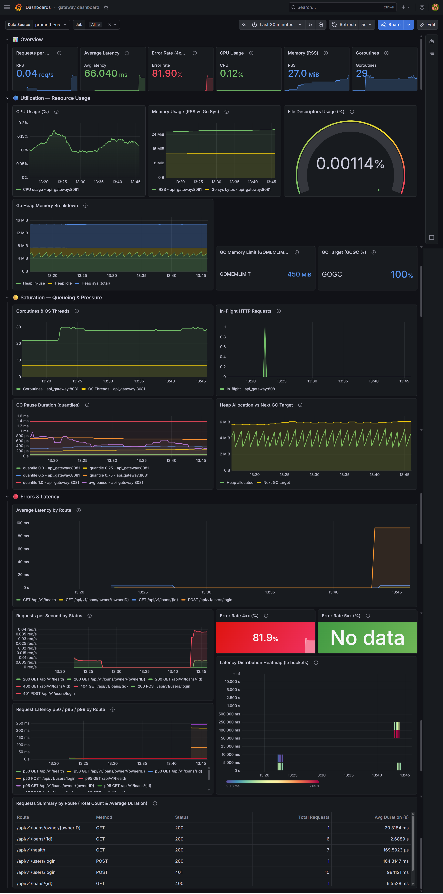

# 📚 Books and Trust


A production-ready **microservices** system for managing book loans between users, built in Go. The system handles user authentication, loan lifecycle management, and borrower trust/banning — all connected via gRPC, with a full observability and security stack.

---

## 🏗️ Architecture

```
                         ┌─────────────────────┐
                         │     Client (HTTP)    │
                         └──────────┬──────────┘
                                    │ REST / JSON
                         ┌──────────▼──────────┐
                         │     API Gateway      │
                         │  ┌───────────────┐   │
                         │  │ Rate Limiter  │   │  ← Global / Per-IP / Per-UserID
                         │  │ JWT Auth      │   │
                         │  │ Circuit Breaker│  │
                         │  │ Redis Cache   │   │  ← Atomic Lua Scripts (EVALSHA)
                         │  │ Security Hdrs │   │
                         │  └───────────────┘   │
                         └────┬────────────┬───┘
                              │ gRPC       │ gRPC
               ┌──────────────▼──┐    ┌───▼──────────────┐
               │  User Service   │    │   Loan Service    │
               │  (PostgreSQL)   │    │  (PostgreSQL)     │
               └─────────────────┘    └───────────────────┘
```

**Services:**

| Service | Role | Protocol | Port |
|---|---|---|---|
| `api-gateway` | HTTP entry point, auth, rate limiting, routing | REST → gRPC | 8081 |
| `user-service` | User registration & authentication | gRPC | 9091 |
| `loan-service` | Loan CRUD, ban management | gRPC | 9092 |

---

## 🛠️ Tech Stack

**Backend**
- **Go 1.25** — language
- **gRPC + Protobuf** — inter-service communication
- **Chi** — HTTP router in the API gateway
- **GORM** — ORM for PostgreSQL
- **golang-migrate** — versioned database migrations
- **JWT (golang-jwt/v5)** — stateless authentication
- **Redis + Lua/EVALSHA** — atomic rate limiting operations
- **Circuit Breaker** (`sony/gobreaker`) — downstream resilience

**Infrastructure**
- **Docker + Docker Compose** — containerization with hardened containers
- **PostgreSQL 16** — separate DB per service (database-per-service pattern)

**Observability**
- **OpenTelemetry (OTLP)** — distributed tracing propagated end-to-end
- **Jaeger** — trace visualization
- **Prometheus** — metrics collection
- **Grafana** — dashboards
- **Loki** — log aggregation
- **Fluentd** — log forwarding

**Testing & Load**
- **SQLite in-memory** — fast integration tests without Docker
- **k6** — load testing for Circuit Breaker and Rate Limiter validation

---

## 📁 Project Structure

```
books-and-trust/
├── services/
│   ├── api-gateway/              # HTTP gateway: routing, auth, gRPC clients
│   │   ├── cmd/
│   │   │   └── api/
│   │   │       └── main.go       # Entry point — wires everything together
│   │   ├── config/               # Config loading from env
│   │   ├── internal/
│   │   │   ├── app/
│   │   │   │   ├── app.go        # Application bootstrap & dependency wiring
│   │   │   │   ├── server.go     # HTTP server with graceful shutdown
│   │   │   │   └── mount.go      # Route registration
│   │   │   ├── middleware/       # Rate limiting, JWT auth, security headers, logging
│   │   │   └── handler/          # HTTP handlers per domain
│   │   ├── docs/                 # Swagger JSON
│   │   └── util/                 # gRPC error mapping, JSON helpers, trace logger
│   ├── user-service/
│   │   ├── cmd/
│   │   ├── config/
│   │   └── internal/
│   │       ├── domain/           # Entities & repository interfaces
│   │       ├── service/          # Business logic (depends only on interfaces)
│   │       ├── handler/grpc/     # gRPC handlers
│   │       └── infra/repo/       # DB implementation of domain interfaces
│   └── loan-service/
│       ├── cmd/
│       ├── internal/
│       │   ├── domain/           # Loan & BannedUser entities + interfaces
│       │   ├── service/          # Business logic (depends only on interfaces)
│       │   ├── handler/grpc/     # gRPC handlers
│       │   └── infra/repo/       # DB implementation of domain interfaces
│       ├── migrations/           # 10 versioned SQL migration files
│       └── test/                 # Integration tests (gRPC + SQLite in-memory)
├── shared/
│   ├── proto/loan/               # Compiled Protobuf (Go)
│   ├── contracts/                # Shared request/response types
│   └── env/                      # Env helper utilities
├── proto/                        # .proto source definitions
├── infrastructure/
│   └── deployment/
│       ├── api-gateway.Dockerfile
│       ├── user-service.Dockerfile
│       ├── loan-service.Dockerfile
│       ├── otel-collector-config.yml
│       └── prometheus.yml
├── docker-compose.yml
└── .env.example
```

---

## 🔐 Security

Security was a first-class concern throughout the design of this project.

### HTTP Security Headers

Every response from the API Gateway includes hardened security headers:

```
X-Content-Type-Options:  nosniff
X-Frame-Options:         DENY
Referrer-Policy:         strict-origin-when-cross-origin
Content-Security-Policy: (custom policy)
```

### Three-Layer Rate Limiting

The gateway enforces three independent rate limiters, each backed by **Redis with atomic Lua scripts (EVALSHA)**:

| Layer | Scope | Purpose |
|---|---|---|
| **Global** | Entire application | Protects against overall traffic spikes |
| **Per-IP** | Client IP address | Prevents abuse from a single source |
| **Per-UserID** | Authenticated user | Limits API misuse per account |

Redis operations are atomic via Lua scripts to eliminate race conditions under concurrent load.

### Password Validation

Password strength is enforced server-side using **regex-based validation** — ensuring minimum complexity requirements before storing any credentials.

### Docker Security Hardening (Defense in Depth)

Every service container is hardened:

```yaml
read_only: true              # immutable filesystem
cap_drop: [ALL]              # zero Linux capabilities granted
security_opt:
  - no-new-privileges:true   # no privilege escalation
init: true                   # correct PID 1 signal handling
pids_limit: 150              # PID exhaustion prevention
mem_limit: 512m              # OOM protection
cpus: "1.0"                  # CPU starvation prevention
tmpfs:
  - /tmp:rw,nosuid,nodev,noexec,size=64m   # safe writable scratch space
```

### Network Isolation

Docker networks are split into two isolated segments:

```
app  (bridge) — gateway ↔ services ↔ observability stack
db   (bridge, internal) — services ↔ databases ONLY
```

The `db` network is **internal**, meaning database containers are never reachable from outside Docker. Services can talk to the DB, but the gateway cannot directly reach the databases — enforcing **security in depth**.

---

## ⚡ Performance

### Minimal Docker Images (~35 MB per service)

All service Dockerfiles use **multi-stage builds** with a `scratch` final image:

```dockerfile
# Stage 1: build
FROM golang:1.25-alpine AS builder
RUN go build -trimpath -ldflags="-w -s" -o /app/service ./cmd/api

# Stage 2: runtime — nothing but the binary
FROM scratch AS runtime
COPY --from=builder /app/service /app/service
ENTRYPOINT ["/app/service"]
```

Build cache is optimized with `--mount=type=cache` for both Go module downloads and the build cache. Final images weigh approximately **35 MB**.

### Go Runtime Tuning

Each service is configured with:
- `GOMEMLIMIT` — Go's soft memory limit to reduce GC pressure
- `GOGC` — tuned garbage collector target
- `automaxprocs` — automatically sets `GOMAXPROCS` to match container CPU quota

### Redis Caching

The API Gateway uses Redis for caching frequently accessed data, reducing downstream gRPC calls to backing services.

### Circuit Breaker

Downstream gRPC calls are wrapped with `sony/gobreaker`. If a service becomes unhealthy, the circuit opens immediately, preventing cascading failures and returning fast errors instead of stacking timeouts.

---

## 🏛️ Clean Architecture & Interface-Driven Design

Each service follows a strict layered architecture where **layers communicate only through interfaces**:

```
Handler (gRPC) → Service interface → Repository interface → DB
```

- The `service` layer depends on the `domain` repository **interface**, never on a concrete implementation
- The `handler` layer depends on the `service` **interface**, never on business logic directly
- This makes each layer independently **testable** and **replaceable** without touching other layers

**Application lifecycle in the API Gateway** is structured across four files:

| File | Responsibility |
|---|---|
| `main.go` | Entry point — loads config, calls `app.Run()` |
| `app.go` | Wires all dependencies (logger, Redis, gRPC clients, middlewares) |
| `server.go` | HTTP server with **graceful shutdown** (drains connections on SIGTERM/SIGINT) |
| `mount.go` | Registers all routes and middleware chains |

**Graceful shutdown** ensures in-flight requests complete before the process exits, making the gateway safe to deploy and restart without dropped connections.

---

## 🗄️ Database Schema

### Loan Service

**`loans`** table (10 versioned migrations):

| Column | Type | Notes |
|---|---|---|
| id | UUID | Primary key |
| owner_id | UUID | Book owner |
| user_id | UUID | Borrower |
| book_name | VARCHAR(255) | |
| status | ENUM | Loan status lifecycle |
| delivery_code | VARCHAR | Handover verification |
| deadline | TIMESTAMPTZ | Return deadline |
| created_at | TIMESTAMPTZ | |
| deleted_at | TIMESTAMPTZ | Soft delete |

**`banned_users`** table:

| Column | Type | Notes |
|---|---|---|
| user_id | UUID | Banned user |
| reason | VARCHAR(500) | Ban reason |
| expired_at | TIMESTAMPTZ | Nullable — permanent or temporary ban |
| created_at | TIMESTAMPTZ | |
| deleted_at | TIMESTAMPTZ | Soft delete |

---

## 🧪 Testing

### Integration Tests (gRPC + SQLite)

Integration tests run with an **in-memory SQLite database** and a live gRPC server over `bufconn` — no Docker or external services needed:

```bash
cd services/loan-service
go test ./test/... -v
```

Architecture is wired exactly as production: `repo → service → grpc_handler → registered server → client`.

### Load Tests (k6)

Circuit Breaker and Rate Limiter behaviour is validated with **k6 JavaScript load tests**, which simulate concurrent traffic patterns to confirm:
- Rate limiting kicks in at the correct thresholds (global, per-IP, per-user)
- The circuit breaker opens under failure conditions and closes after recovery

```bash
k6 run infrastructure/tests/rate_limiter_test.js
k6 run infrastructure/tests/circuit_breaker_test.js
```

### Request Logging

Every request is logged with a **structured logger** (Zap) enriched with:
- `user_id` — extracted from the JWT on authenticated routes
- `request_id` — unique per-request trace identifier
- `trace_id` / `span_id` — from OpenTelemetry span context

This makes log correlation with Jaeger traces straightforward in Grafana/Loki.

---

## 🔁 CI/CD

Each service (`api-gateway`, `user-service`, `loan-service`) has its own **independent GitHub Actions pipeline**, triggered only when files under that service's path change — keeping CI fast and avoiding unnecessary rebuilds of unrelated services.

**Pipeline stages (per service):**

```
lint  →  test (with coverage)  →  build & scan docker image  →  push to GHCR
```

1. **Lint** — static analysis with `golangci-lint`
2. **Test** — `go test` with coverage report; gated on lint passing
3. **Build & Scan** — multi-stage Docker image build, scanned with **Trivy** for `CRITICAL`/`HIGH` vulnerabilities (the pipeline fails the build if any are found, ignoring unfixed CVEs)
4. **Push** — on `main` only (not on pull requests), the image is pushed to **GitHub Container Registry (GHCR)**, tagged by branch, semver, and short commit SHA

This means every service ships its own versioned, vulnerability-scanned container image automatically on every merge to `main`.

### Branch Protection

The `main` branch is protected by a ruleset: direct pushes are disabled, and all changes must go through a pull request where the relevant service's CI pipeline (lint, test, build & scan) must pass before merging is allowed.

---

## 🚀 Getting Started

### Prerequisites

- [Docker](https://docs.docker.com/get-docker/) and Docker Compose
- Go 1.25+ (for local development only)
- k6 (optional, for load tests)

### 1. Clone the repo

```bash
git clone https://github.com/Mohammad-khos/books-and-trust.git
cd books-and-trust
```

### 2. Set up environment variables

```bash
cp .env.example .env
# Defaults work out of the box for local development
```

### 3. Start all services

```bash
docker compose up --build
```

> **Note:** On the very first `docker compose up -d`, the Fluentd log driver may fail to connect before the network is fully initialized. If services don't start correctly, run `docker compose up` again — this is a known issue with Docker log driver initialization order (see Known Issues below).

### 4. Explore the API

Open **Swagger UI**: [http://localhost:8082](http://localhost:8082)

---

## 📊 Observability

| Tool | URL | Purpose |
|---|---|---|
| Jaeger | http://localhost:16686 | Distributed traces |
| Grafana | http://localhost:3000 | Metrics & logs dashboards (admin/admin) |
| Prometheus | http://localhost:9999 | Metrics scraping |
| Swagger UI | http://localhost:8082 | Interactive API documentation |
| Loki | http://localhost:3100 | Log aggregation |



Traces are propagated end-to-end from HTTP request → API Gateway → gRPC call → downstream service, all correlated by `trace_id`.

---

## ⚙️ Configuration

All configuration is via environment variables. See [`.env.example`](.env.example) for the full list.

Key variables:

| Variable | Description |
|---|---|
| `JWT_SECRET` | Secret key for signing JWT tokens |
| `USER_SERVICE_ADDR` | gRPC address of the user service |
| `LOAN_SERVICE_ADDR` | gRPC address of the loan service |
| `REDIS_ADDR` | Redis address for gateway caching and rate limiting |
| `JAEGER_ENDPOINT` | OTLP gRPC endpoint for distributed tracing |
| `ENVIRONMENT` | `development` or `production` |
| `GOMEMLIMIT` | Go soft memory limit (per service) |
| `GOGC` | GC target percentage (per service) |

---

## ⚠️ Known Issues

This project is a portfolio/learning project. The following issues are documented intentionally:

**1. Gateway Lazy Loading (Cold Start Latency)**
The first request after startup may take several seconds. gRPC client connections are established lazily — the connection to downstream services is not fully initialized until the first real request arrives.

**2. Fluentd Log Driver Race on First Start**
When running `docker compose up -d` for the first time, some containers may fail to start because the Fluentd log driver initializes before the Docker network is ready. Re-running `docker compose up -d` resolves the issue. This is a known Docker Compose limitation with external log drivers.

**3. Incomplete Test Coverage**
Unit and integration tests exist as working examples demonstrating the testing approach and architecture, but do not provide full coverage. They are not meant to be a complete test suite.
